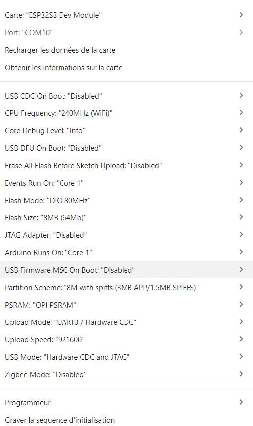

### 📄 `README.md`

```markdown
# 🖥️ IHM_LVGL – Interface Homme-Machine avec LVGL et ESP32

Ce projet présente une interface graphique développée avec **LVGL** (Light and Versatile Graphics Library) pour un écran **TFT Waveshare 7 pouces** piloté par un **ESP32-S3**. Il s'inscrit dans le cadre d'une solution de contrôle pour dispositifs de soins lumineux (LEDs, IR, etc.).

---

## 🚀 Fonctionnalités principales

- Affichage d’une interface utilisateur moderne avec **LVGL**
- Support de l’écran **TFT 7” avec contrôleur ILI9488 (SPI)**
- Intégration d’un écran tactile **XPT2046**
- Contrôle de LEDs (rouge, bleu, IR) via boutons
- Commandes via Bluetooth BLE (ArduinoBLE)
- Lecture et affichage du phototype et du soin sélectionné
- Multilingue : Français, Anglais, Espagnol, Allemand (extensible)

---

## 🛠️ Technologies utilisées

- 🧠 **ESP32-S3**
- 🎨 **LVGL 8.x**
- 🔌 **Arduino IDE**
- 📟 **TFT ILI9488 + XPT2046 (SPI)**
- 📡 **Bluetooth BLE**
- 📁 **I2C pour communication inter-ESP**

---

## 📂 Structure du projet

```

📁 IHM\_LVGL/
├── ui/                    # Fichiers liés à l’interface LVGL
├── Roboto\_Slab/           # Polices utilisées
├── Boxlight/              # Données spécifiques à un soin
├── config.png             #  écran
└── ...

```

---

## 🔧 Installation

1. Installer les bibliothèques nécessaires :
   - `lvgl`
   - `TFT_eSPI` (configuré pour ILI9488)
   - `XPT2046_Touchscreen`
   - `ArduinoBLE`
2. Sélectionner la carte **ESP32-S3** dans l’IDE Arduino
3. Compiler et flasher le fichier `code_dispositifV4.ino`

---

## 🌐 Langues supportées

- 🇫🇷 Français
- 🇬🇧 English
- 🇪🇸 Español
- 🇩🇪 Deutsch

---

## 📸 Aperçu



---

## 📅 État du projet

✅ Version fonctionnelle en cours de test  
🛠️ Optimisation de la gestion mémoire et BLE en cours  
📦 Préparation d’un boîtier physique à venir

---

## 🤝 Contributeurs

- 👨‍💻 **Adrien Tatchum Simo** – Développement, architecture logicielle, interface

---

## 📜 Licence

Ce projet est sous licence **MIT** – voir le fichier [LICENSE](LICENSE) pour plus d’informations.


